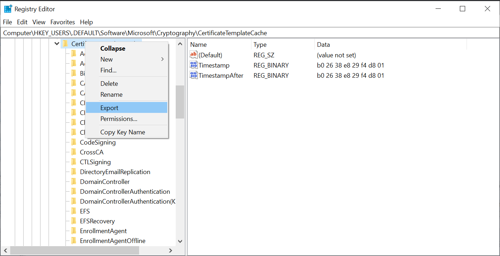

# regcertipy
Parses cached certificate templates from a Windows Registry `.reg` file and 
displays them in the same style as 
[Certipy](https://github.com/ly4k/Certipy) does.

## Getting started
We prefer using the [uv package manager](https://docs.astral.sh/uv/), as it 
will automatically create a virtual environment for you. Alternatively, you 
can use `pip install regcertipy` within any other Python environment that 
you manage.

```
$ uv venv
$ source .venv/bin/activate
$ uv pip install regcertipy
$ regcertipy -h
usage: regcertipy [-h] regfile

Regfile ingestor for Certipy

positional arguments:
  regfile     Path to the .reg file.

options:
  -h, --help  show this help message and exit
```

Use regedit.exe to export the keys under 
`HKEY_USERS\.DEFAULT\Software\ Microsoft\Cryptography\CertificateTemplateCache\`. 
Then, the .reg file can be fed into regcertipy with: regcertipy <regfile>.



## Development
Note that we use the [Black code formatter](https://black.readthedocs.io/en/stable/) 
for code formatting. Moreover, we use the Git Flow branching model, meaning 
that we actively develop on the "develop" branch, and merge to the "main" 
branch (& tag it) when a new release is made, making the "main" branch the 
production branch.

```
$ uv sync --dev # Also installs the Black code formatter.
$ uv run black . # To format the current code base.
$ uv run regcertipy -h
usage: regcertipy [-h] regfile

Regfile ingestor for Certipy

positional arguments:
  regfile     Path to the .reg file.

options:
  -h, --help  show this help message and exit
```

You can also run the `__init__.py` or `__main.py__` Python file in your 
favourite debugger.